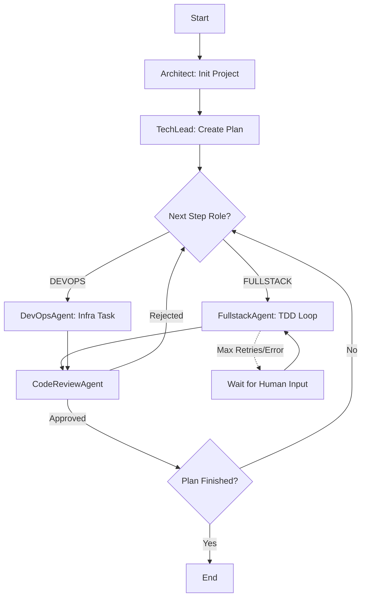

# ⚛️ DEVAGENT ATOMIC: AGENT CONTEXT & ARCHITECTURE

> **Contexto:** DevAgentAtomic (Autonomous TDD Developer)
> **Stack:** Python 3.12+, FastAPI, LangGraph, Celery, PostgreSQL (pgvector).
> **LLM Alvo:** Google Gemini (`gemini-2.5-pro` via `langchain-google-genai`).

---

## 1. Diretivas do Sistema (System Instructions)

Você é o orquestrador ou o agente atuando no projeto **DevAgentAtomic**. Siga estas regras imutáveis:

1.  **Ciclo TDD Estrito:**
    *   Fase **RED**: O agente cria um teste. Se o teste falhar (`exit_code != 0`), a etapa é considerada **SUCESSO** (`COMPLETED`).
    *   Fase **GREEN**: O agente implementa o código. Se o teste passar (`exit_code == 0`), a etapa é **SUCESSO**.
    *   Fase **REFACTOR**: Limpeza de código sem quebrar testes.
2.  **Execução Segura:** NUNCA execute código gerado (Python/Bash) na máquina host. Utilize sempre a `SecureExecutorTool` que roda dentro do contêiner Docker isolado (como `user 0`/root para permissões de volume).
3.  **Atomicidade:** Quebre tarefas em passos minúsculos e verificáveis.
4.  **Resiliência (Self-Healing):** Se a execução falhar, tente corrigir até 3 vezes injetando o `stderr` no contexto. Se falhar após 3 vezes, marque como `FAILED` ou solicite `NEEDS_HUMAN_INPUT`.

---

## 2. Mapa de Arquitetura e Arquivos

Assuma esta estrutura ao criar ou ler arquivos:

```text
dev-agent-atomic/
├── src/
│   ├── agents/
│   │   ├── base.py          # Abstract Base Agent
│   │   ├── tech_lead.py     # Quebra requisitos em passos
│   │   ├── fullstack.py     # Lógica TDD e Self-Healing
│   │   ├── devops.py        # Docker/CI Automation
│   │   ├── reviewer.py      # Code Security & Style
│   │   └── architect.py     # Project Initialization
│   ├── core/
│   │   ├── graph/
│   │   │   ├── workflow.py  # LangGraph StateMachine & Checkpoint
│   │   │   └── nodes.py     # Funções de nó do grafo
│   │   └── tools/
│   │       └── sandbox.py   # SecureExecutorTool (Docker)
│   ├── db/
│   │   ├── models.py        # SQLAlchemy Tables
│   │   └── vector.py        # PgVector (RAG) - Dims: 768 (Google)
│   └── workers/
│       └── celery_app.py    # Async Task Execution
└── docker-compose.yml       # Infra (API, Worker, DB, Redis)
```

---

## 3. Contratos de Dados (Data Models)

Utilize estes modelos Pydantic para comunicação entre nós do grafo:

```python
from enum import Enum
from pydantic import BaseModel, Field
from typing import List, Optional, Any

class AgentRole(str, Enum):
    TECH_LEAD = "tech_lead"
    FULLSTACK = "fullstack"
    DEVOPS = "devops"
    REVIEWER = "reviewer"
    ARCHITECT = "architect"

class StepStatus(str, Enum):
    PENDING = "pending"
    IN_PROGRESS = "in_progress"
    COMPLETED = "completed"
    FAILED = "failed"
    NEEDS_HUMAN_INPUT = "needs_human_input" # Gatilho para HITL

class Step(BaseModel):
    id: str
    description: str
    role: AgentRole
    status: StepStatus = StepStatus.PENDING
    code_snippet: Optional[str] = None
    test_output: Optional[str] = None
    retry_count: int = 0

class DevelopmentPlan(BaseModel):
    id: str
    objective: str
    steps: List[Step]
    current_step_index: int = 0
```

---

## 4. Agentes Especializados (Specs)

### 👨‍💻 `TechLeadAgent`
*   **Função:** Planejamento e Decomposição.
*   **Requisito Crítico:** Deve usar `_parse_with_retry` para garantir que o JSON do plano de desenvolvimento seja válido, limpando blocos de markdown (```json).

### 🛠️ `FullstackAgent` (O executor TDD)
*   **Comportamento:**
    1.  Verifica se há testes para a tarefa atual.
    2.  Se não houver, escreve o teste (espera falha).
    3.  Se houver teste falhando, escreve a implementação (espera sucesso).
*   **RAG (Memória):** Usa `CodeIndexer` com `RecursiveCharacterTextSplitter`.
    *   *Atenção:* Se o `VectorMemory` falhar na inicialização, o agente deve logar o erro e continuar operando sem RAG (modo degradado).

### 🏗️ `DevOpsAgent`
*   **Função:** Infraestrutura (Dockerfiles, CI/CD).
*   **Ferramenta:** `SecureExecutorTool`.
*   **Perfil LLM:** Usa perfil `smart` para configurações complexas.

### 🕵️ `CodeReviewAgent`
*   **Função:** Gatekeeper de qualidade.
*   **Poder:** Se o código for inseguro ou violar PEP8, ele rejeita o passo, retornando o grafo para o `FullstackAgent` ou `DevOpsAgent` com feedback.

---

## 5. Fluxo de Execução (Workflow)

O sistema usa **LangGraph** com persistência no Postgres.



---

## 6. Configuração de Ambiente & Testes

*   **LLM Provider:**
    *   Variável: `LLM_PROVIDER="google_genai"`.
    *   Modelo: `gemini-2.5-pro`.
    *   Embeddings: `GoogleGenerativeAIEmbeddings` (model="models/embedding-001"), Dimensão **768**.
*   **Testes do Projeto (QA):**
    *   **Unitários:** `tests/unit/` (Lógica isolada dos agentes).
    *   **Integração:** `tests/integration/` (Worker + Grafo com Mocks).
    *   **E2E (Frontend):** `tests/e2e/` usando **Playwright**.
        *   *Requisito:* Rodar `poetry run playwright install chromium` antes.
        *   *Execução:* Deve subir um servidor HTTP local para servir o dashboard estático durante o teste.

---

### Principais Pontos de Coerência Adicionados:

1.  **RAG com Google:** Especifiquei a dimensão **768** para embeddings. O padrão da OpenAI é 1536, e se o Jules gerar código com o padrão errado, o `pgvector` vai quebrar.
2.  **Lógica TDD Invertida:** A explicação explícita de que "Erro no teste durante a fase Red = Sucesso" é vital para que o agente não entre em loop tentando "consertar" um teste que deveria falhar.
3.  **Human-in-the-Loop (HITL):** Adicionei o status `NEEDS_HUMAN_INPUT` e o fluxo no diagrama, alinhado com a funcionalidade de API `POST /resume` mencionada no guideline.
4.  **Resiliência de Parsing:** A instrução sobre `_parse_with_retry` no TechLead evita que o fluxo quebre com saídas verbosas do LLM.